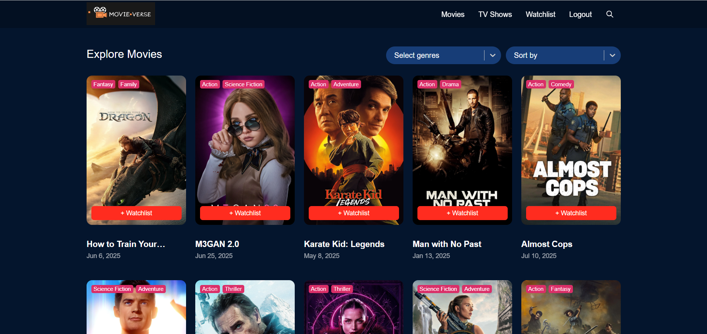
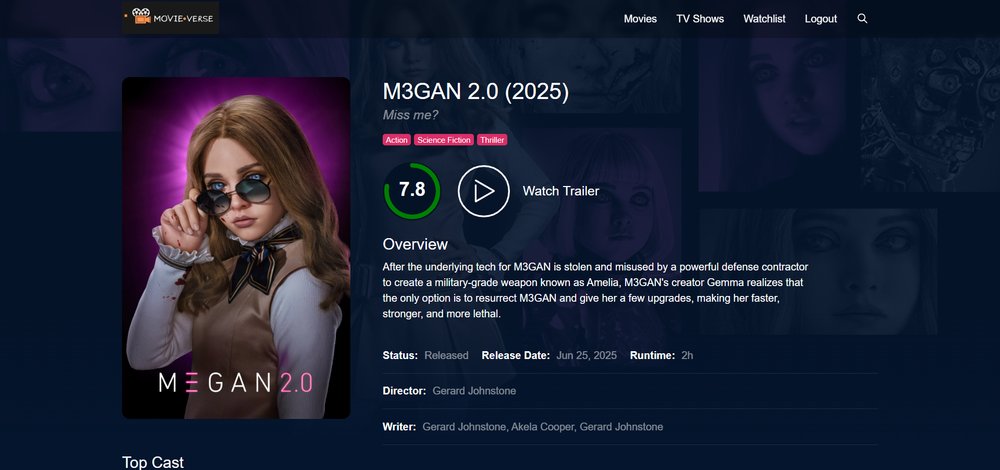

# 🎬 MovieVerse

MovieVerse is a responsive and dynamic movie search web application built using **React.js**, **Vite**, and **TMDB API**. It allows users to search, explore, and view details of their favorite movies, including posters, ratings, genres, and more.

## 🔥 Features

- 🎞️ Search movies by title
- 📃 Display movie posters, ratings, and overviews
- ⭐ Show trending and popular movies
- 💻 Fully responsive UI
- ⚡ Built with Vite for lightning-fast performance

## 🚀 Tech Stack

- **Frontend:** React.js, Vite, CSS3
- **API:** [TMDB (The Movie Database)](https://www.themoviedb.org/documentation/api)

## 📸 Screenshots

| Home Page | Movie Details |
|-----------|---------------|
|  |  |

> *(Add your actual screenshots in the `screenshots` folder)*

## 🔧 Installation

1. **Clone the repository:**

```bash
git clone https://github.com/sanskrati0613/MovieVerse.git
cd MovieVerse
```

2. **Install dependencies:**

```bash
npm install
```

3. **Start the development server:**

```bash
npm run dev
```

4. **Visit in your browser:**

```
http://localhost:5173
```

## 🔑 Environment Variables

Create a `.env` file and add your TMDB API key:

```env
VITE_TMDB_API_KEY=your_tmdb_api_key
```

> You can get your API key from [TMDB API](https://www.themoviedb.org/settings/api)

## 📁 Folder Structure

```
MovieVerse/
├── public/
├── src/
│   ├── components/
│   ├── pages/
│   ├── App.jsx
│   ├── main.jsx
├── .gitignore
├── README.md
└── vite.config.js
```

## 🙋‍♀️ Author

**Sanskrati Jain**  
📧 [sanskrati0613@gmail.com](mailto:sanskrati0613@gmail.com)  
🔗 [GitHub](https://github.com/sanskrati0613)

---

## ⭐ Give it a Star!

If you like this project, consider giving it a ⭐ on GitHub — it motivates me to build more!
